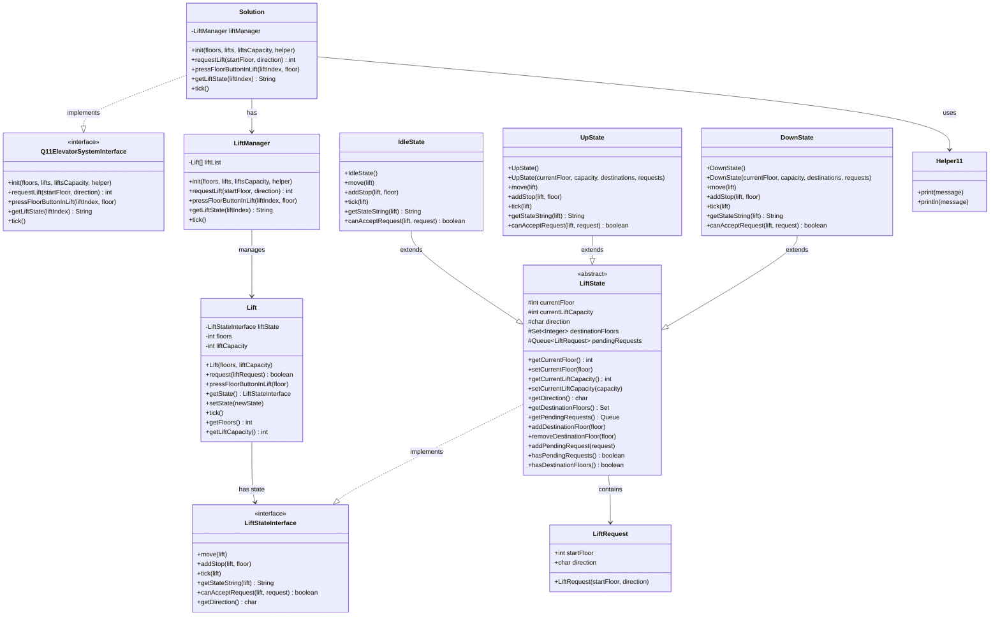
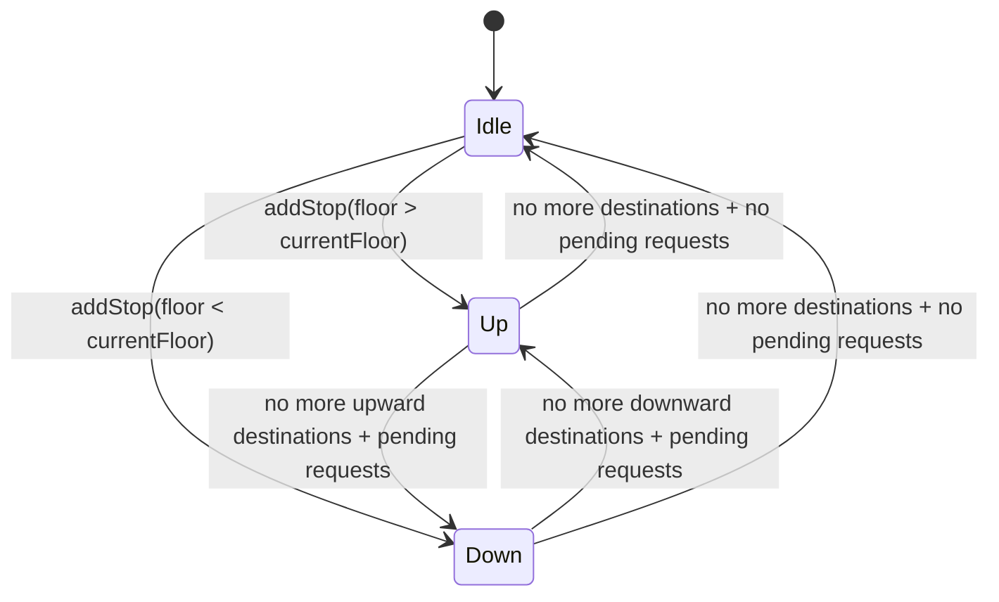

# 🏗️ Elevator System - Entity Relationship Diagram (ERD)

## 📊 Class Diagram

## 🔗 Relationship Details

### 1. **Solution → LiftManager**
- **Type:** Composition (1:1)
- **Description:** Solution contains one LiftManager instance
- **Purpose:** Delegates all elevator operations to LiftManager

### 2. **LiftManager → Lift**
- **Type:** Aggregation (1:N)
- **Description:** LiftManager manages an array of Lift objects
- **Purpose:** Coordinates multiple lifts in the building

### 3. **Lift → LiftStateInterface**
- **Type:** Association (1:1)
- **Description:** Each Lift has one current state
- **Purpose:** Implements State Pattern for lift behavior

### 4. **LiftState → LiftRequest**
- **Type:** Aggregation (1:N)
- **Description:** State contains collections of requests and destinations
- **Purpose:** Manages pending requests and destination floors

### 5. **State Inheritance Hierarchy**
- **Type:** Inheritance
- **Description:** IdleState, UpState, DownState extend LiftState
- **Purpose:** Different behaviors for different lift states

## 📋 Entity Attributes

### **Solution**
- `liftManager: LiftManager` - Manager instance

### **LiftManager**
- `liftList: Lift[]` - Array of lift instances

### **Lift**
- `liftState: LiftStateInterface` - Current state
- `floors: int` - Total number of floors
- `liftCapacity: int` - Maximum people capacity

### **LiftState (Base)**
- `currentFloor: int` - Current floor position
- `currentLiftCapacity: int` - Current number of people
- `direction: char` - Current direction (U/D/I)
- `destinationFloors: Set<Integer>` - Floors to stop at
- `pendingRequests: Queue<LiftRequest>` - Pending requests

### **LiftRequest**
- `startFloor: int` - Requesting floor
- `direction: char` - Requested direction (U/D)

### **Helper11**
- Utility methods for logging

## 🎯 Design Patterns Used

### 1. **State Pattern**
- **Purpose:** Manage lift behavior based on current state
- **Classes:** LiftStateInterface, LiftState, IdleState, UpState, DownState
- **Benefits:** Clean state transitions, extensible behavior

### 2. **Facade Pattern**
- **Purpose:** Simplify complex subsystem interface
- **Classes:** Solution implements Q11ElevatorSystemInterface
- **Benefits:** Clean API, hides internal complexity

### 3. **Manager Pattern**
- **Purpose:** Centralized coordination of multiple entities
- **Classes:** LiftManager manages Lift array
- **Benefits:** Single point of control, easy scaling

## 🔄 State Transitions

## 📊 Data Flow

1. **Initialization:** Solution → LiftManager → Lift[] → IdleState
2. **Request Processing:** Request → LiftManager → Lift → State.canAcceptRequest()
3. **State Changes:** Lift.setState() → New State Instance
4. **Time Simulation:** tick() → State.tick() → Movement/State Transitions
5. **State Reporting:** getLiftState() → State.getStateString()

This ERD shows a well-structured, object-oriented design with clear separation of concerns and proper use of design patterns for the elevator system. 