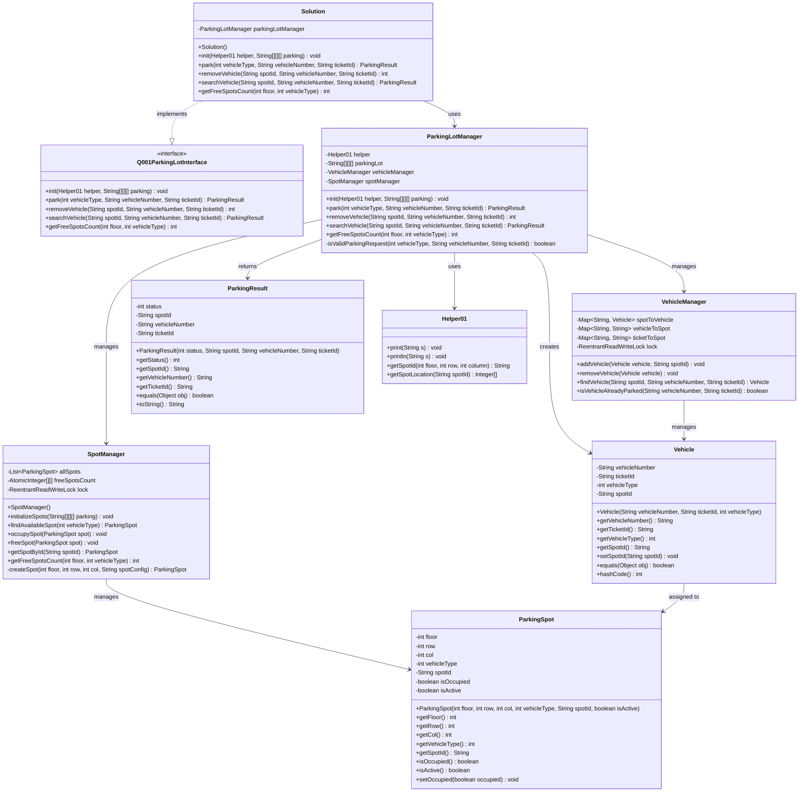
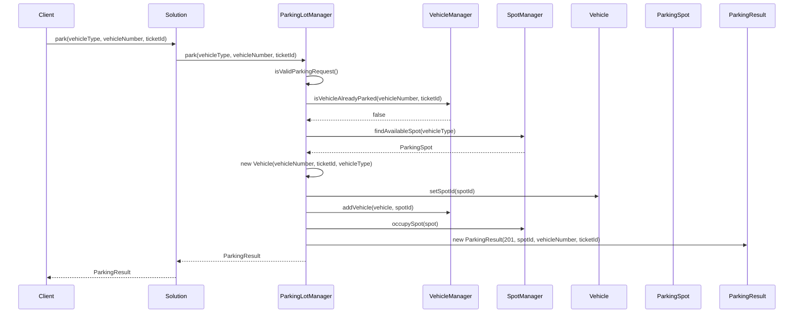
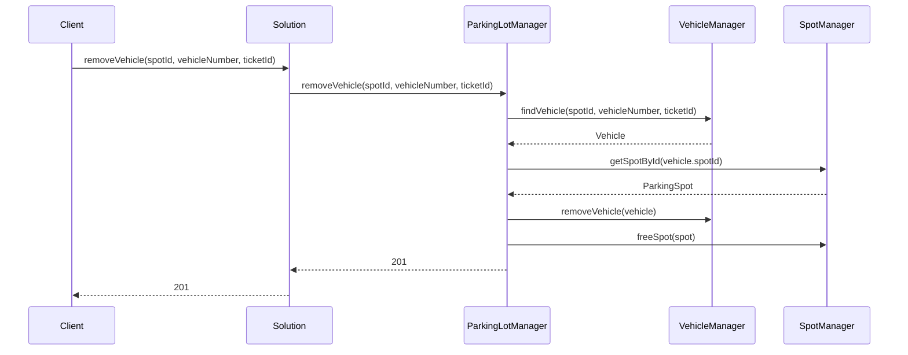

# 🏗️ Parking Lot System - UML Class Diagram

## 📊 Complete UML Class Diagram



## 🔄 Sequence Diagram - Parking Operation



## 🔄 Sequence Diagram - Vehicle Removal



## 🎯 Design Patterns Used

### 1. **Manager Pattern**
- `ParkingLotManager`: Orchestrates business logic
- `VehicleManager`: Manages vehicle data and relationships
- `SpotManager`: Manages parking spots and availability

### 2. **Factory Pattern**
- `SpotManager.createSpot()`: Creates parking spots from configuration

### 3. **Value Object Pattern**
- `Vehicle`: Encapsulates vehicle data
- `ParkingSpot`: Encapsulates spot data

### 4. **Facade Pattern**
- `ParkingLotManager`: Simplifies complex parking operations

## 🏗️ Architecture Benefits

### **Separation of Concerns**
- **Solution**: Interface implementation and delegation
- **ParkingLotManager**: Business logic and coordination
- **VehicleManager**: Vehicle tracking and relationships
- **SpotManager**: Spot management and allocation
- **Vehicle/ParkingSpot**: Data encapsulation

### **Thread Safety**
- `ReentrantReadWriteLock` for concurrent access
- `ConcurrentHashMap` for thread-safe collections
- `AtomicInteger` for thread-safe counters

### **Extensibility**
- Easy to add new vehicle types
- Easy to add new parking strategies
- Easy to add new business rules

### **Maintainability**
- Clear class responsibilities
- Minimal coupling
- Comprehensive error handling

## 📊 Data Flow

```
Client Request → Solution → ParkingLotManager → [VehicleManager + SpotManager] → Response
```

## 🔧 Key Features

1. **Multi-threading Support**: Thread-safe operations
2. **Flexible Search**: Search by spotId, vehicleNumber, or ticketId
3. **Robust Error Handling**: Consistent error responses
4. **Efficient Data Structures**: O(1) lookups for most operations
5. **Business Logic Centralization**: All rules in ParkingLotManager

This UML diagram represents a production-ready, scalable parking lot system with proper design patterns and thread safety. 