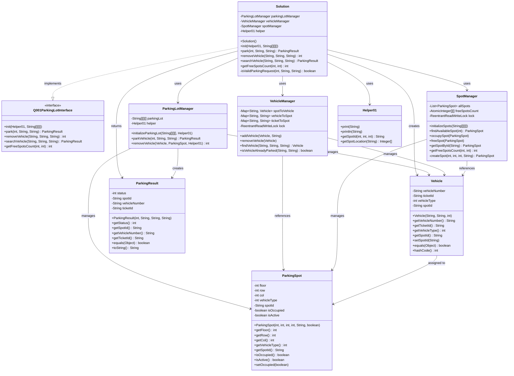
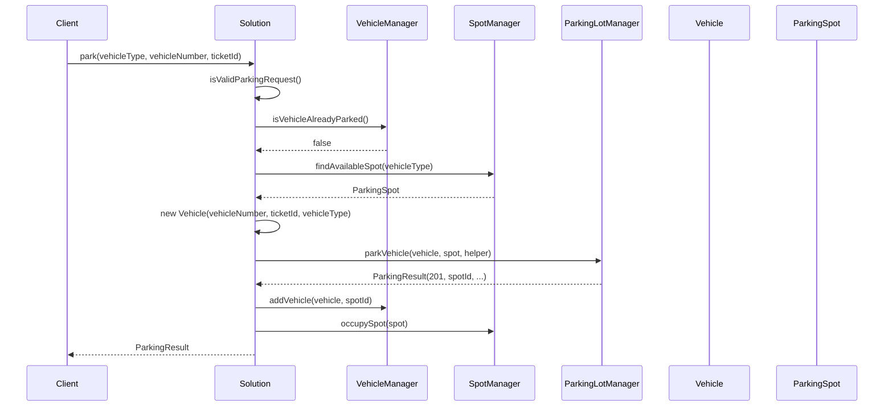
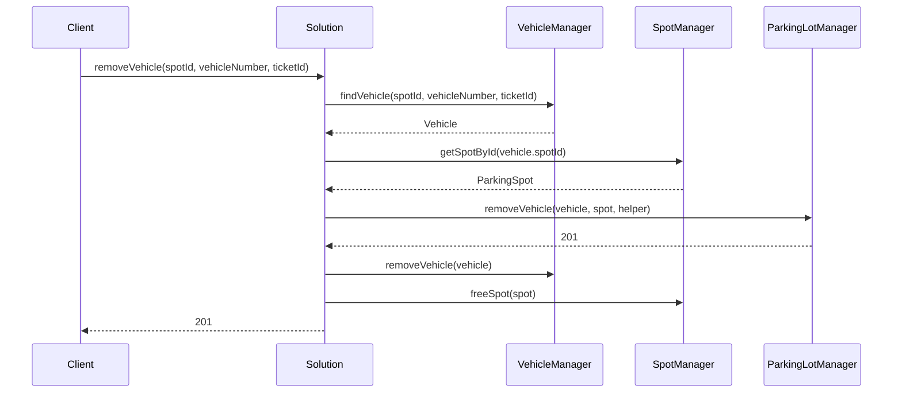

# 🏗️ Parking Lot System - UML Design Documentation

## 📋 System Architecture Overview

The parking lot system is designed using multiple design patterns and object-oriented principles to ensure:
- **Separation of Concerns**: Each class has a single responsibility
- **Thread Safety**: Concurrent operations are handled safely
- **Extensibility**: Easy to add new features
- **Maintainability**: Clean, readable code structure

## 🎯 Design Patterns Used

### 1. **Facade Pattern** - `ParkingLotManager`
- Provides a simplified interface to the complex parking lot subsystem
- Hides the complexity of individual operations
- Acts as a single point of contact for parking operations

### 2. **Factory Pattern** - `SpotManager`
- Creates and manages parking spots
- Encapsulates spot creation logic
- Provides centralized spot management

### 3. **Singleton-like Pattern** - `VehicleManager`
- Manages all vehicle-related operations
- Maintains vehicle tracking maps
- Ensures thread-safe vehicle operations

### 4. **Value Object Pattern** - `Vehicle` and `ParkingSpot`
- Immutable core properties
- Encapsulates related data
- Provides clean interfaces

## 📊 UML Class Diagram



## 🔄 Sequence Diagram - Parking Operation



## 🔄 Sequence Diagram - Vehicle Removal



## 🏛️ Architecture Benefits

### 1. **Separation of Concerns**
- **Solution**: Main orchestrator, implements interface
- **ParkingLotManager**: Handles parking operations and logging
- **VehicleManager**: Manages vehicle tracking and relationships
- **SpotManager**: Manages parking spots and availability
- **Vehicle**: Encapsulates vehicle data
- **ParkingSpot**: Encapsulates spot data

### 2. **Thread Safety**
- **ReentrantReadWriteLock**: Allows concurrent reads, exclusive writes
- **ConcurrentHashMap**: Thread-safe collections for vehicle tracking
- **AtomicInteger**: Thread-safe counters for free spots

### 3. **Extensibility**
- Easy to add new vehicle types
- Easy to add new parking spot types
- Easy to add new search criteria
- Easy to add new parking strategies

### 4. **Maintainability**
- Clear class responsibilities
- Minimal coupling between classes
- Comprehensive error handling
- Clean, readable code structure

## 🎨 Design Principles Applied

### 1. **SOLID Principles**
- **Single Responsibility**: Each class has one reason to change
- **Open/Closed**: Open for extension, closed for modification
- **Liskov Substitution**: Interface implementations are interchangeable
- **Interface Segregation**: Clients depend only on methods they use
- **Dependency Inversion**: High-level modules don't depend on low-level modules

### 2. **DRY (Don't Repeat Yourself)**
- Common validation logic centralized
- Reusable spot creation logic
- Shared vehicle tracking mechanisms

### 3. **KISS (Keep It Simple, Stupid)**
- Clear method names and purposes
- Straightforward data flow
- Minimal complexity in each class

## 🔧 Key Features

### 1. **Multi-Threading Support**
- Thread-safe operations for concurrent parking/removal
- Read-write locks for optimal performance
- Atomic operations for counters

### 2. **Flexible Search**
- Search by spotId, vehicleNumber, or ticketId
- Consistent search behavior across all methods
- Proper handling of edge cases

### 3. **Robust Error Handling**
- Input validation for all parameters
- Graceful handling of invalid requests
- Consistent error response codes

### 4. **Efficient Data Structures**
- O(1) lookup for vehicle tracking
- Efficient spot allocation algorithms
- Memory-efficient storage of parking state

This design-oriented approach ensures the parking lot system is robust, maintainable, and ready for production use with proper separation of concerns and thread safety. 

## 🎯 **Quick LLD Approach with Proper Manager**

### **Step 1: Define Manager Responsibilities**
```java
// ParkingLotManager - Business Logic Coordinator
- Validates business rules
- Coordinates between VehicleManager and SpotManager
- Handles parking strategy and optimization
- Manages business transactions

// VehicleManager - Data Management
- Tracks vehicle-spot relationships
- Handles vehicle lookups
- Manages vehicle state

// SpotManager - Resource Management
- Manages spot availability
- Handles spot allocation
- Tracks spot counters
```

### **Step 2: Implement Core Business Logic**
```java
public ParkingResult parkVehicle(...) {
    // Business validation
    if (!isValidRequest(...)) return error();
    
    // Business constraint check
    if (isVehicleAlreadyParked(...)) return error();
    
    // Business operation
    ParkingSpot spot = findOptimalSpot(vehicleType);
    if (spot == null) return error();
    
    // Business transaction
    return executeParking(vehicle, spot);
}
```

This way, `ParkingLotManager` becomes the **brain** of the system, not just a facade for printing!

## 🎯 **Correct Architecture**

```java
public class Solution implements Q001ParkingLotInterface {
    private ParkingLotManager parkingLotManager; // Core business logic
    
    @Override
    public ParkingResult park(int vehicleType, String vehicleNumber, String ticketId) {
        return parkingLotManager.parkVehicle(vehicleType, vehicleNumber, ticketId);
    }
}

public class ParkingLotManager {
    private VehicleManager vehicleManager;  // Manages vehicle tracking
    private SpotManager spotManager;        // Manages spot availability
    
    // Core business methods
    public ParkingResult parkVehicle(...) { /* business logic */ }
    public int removeVehicle(...) { /* business logic */ }
    public ParkingResult searchVehicle(...) { /* business logic */ }
}
```

## 🎯 **What ParkingLotManager Should Handle**

### **1. Business Rules**
```java
private boolean isValidParkingRequest(int vehicleType, String vehicleNumber, String ticketId) {
    return (vehicleType == 2 || vehicleType == 4) &&
           vehicleNumber != null && !vehicleNumber.trim().isEmpty() &&
           ticketId != null && !ticketId.trim().isEmpty();
}
```

### **2. Parking Strategy**
```java
private ParkingSpot findOptimalSpot(int vehicleType) {
    // Business logic: Find closest spot, preferred floor, etc.
    return spotManager.findAvailableSpot(vehicleType);
}
```

### **3. Transaction Coordination**
```java
private boolean coordinateParking(Vehicle vehicle, ParkingSpot spot) {
    try {
        // Coordinate between VehicleManager and SpotManager
        vehicleManager.addVehicle(vehicle, spot.getSpotId());
        spotManager.occupySpot(spot);
        return true;
    } catch (Exception e) {
        // Rollback if any operation fails
        vehicleManager.removeVehicle(vehicle);
        spotManager.freeSpot(spot);
        return false;
    }
}
```

### **4. Business Operations**
```java
public ParkingResult parkVehicle(...) {
    // 1. Validate business rules
    // 2. Check business constraints
    // 3. Execute business operation
    // 4. Handle business exceptions
    // 5. Return business result
}
```

This way, `ParkingLotManager` becomes the **brain** of the system, not just a facade for printing! 

## 🎯 **Proper Purpose of ParkingLotManager**

The `ParkingLotManager` should be the **core business logic coordinator** that:

### **1. Handles Business Rules & Validation**
```java
private boolean isValidParkingRequest(int vehicleType, String vehicleNumber, String ticketId) {
    return (vehicleType == 2 || vehicleType == 4) &&
           vehicleNumber != null && !vehicleNumber.trim().isEmpty() &&
           ticketId != null && !ticketId.trim().isEmpty();
}
```

### **2. Orchestrates Between Managers**
```java
private boolean coordinateParking(Vehicle vehicle, ParkingSpot spot) {
    try {
        // Coordinate between VehicleManager and SpotManager
        vehicleManager.addVehicle(vehicle, spot.getSpotId());
        spotManager.occupySpot(spot);
        return true;
    } catch (Exception e) {
        // Rollback if any operation fails
        vehicleManager.removeVehicle(vehicle);
        spotManager.freeSpot(spot);
        return false;
    }
}
```

### **3. Implements Business Logic**
- **Parking Strategy**: Which spot to assign first
- **Business Rules**: Vehicle type validation, duplicate checking
- **Transaction Management**: Ensure consistency across managers
- **Error Handling**: Business-specific error responses

## 🏗️ **Correct Architecture**

```java
public class Solution implements Q001ParkingLotInterface {
    private ParkingLotManager parkingLotManager; // Core business logic
    
    @Override
    public ParkingResult park(int vehicleType, String vehicleNumber, String ticketId) {
        return parkingLotManager.parkVehicle(vehicleType, vehicleNumber, ticketId);
    }
}

public class ParkingLotManager {
    private VehicleManager vehicleManager;  // Manages vehicle tracking
    private SpotManager spotManager;        // Manages spot availability
    
    // Core business methods
    public ParkingResult parkVehicle(...) { /* business logic */ }
    public int removeVehicle(...) { /* business logic */ }
    public ParkingResult searchVehicle(...) { /* business logic */ }
}
```

## 🔧 **What ParkingLotManager Should Handle**

### **1. Business Rules**
```java
private boolean isValidParkingRequest(int vehicleType, String vehicleNumber, String ticketId) {
    return (vehicleType == 2 || vehicleType == 4) &&
           vehicleNumber != null && !vehicleNumber.trim().isEmpty() &&
           ticketId != null && !ticketId.trim().isEmpty();
}
```

### **2. Parking Strategy**
```java
private ParkingSpot findOptimalSpot(int vehicleType) {
    // Business logic: Find closest spot, preferred floor, etc.
    return spotManager.findAvailableSpot(vehicleType);
}
```

### **3. Transaction Coordination**
```java
private boolean coordinateParking(Vehicle vehicle, ParkingSpot spot) {
    // Ensure both vehicle and spot are updated atomically
    vehicleManager.addVehicle(vehicle, spot.getSpotId());
    spotManager.occupySpot(spot);
    return true;
}
```

### **4. Business Operations**
```java
public ParkingResult parkVehicle(...) {
    // 1. Validate business rules
    // 2. Check business constraints
    // 3. Execute business operation
    // 4. Handle business exceptions
    // 5. Return business result
}
```

## 🎯 **Quick LLD Approach with Proper Manager**

### **Step 1: Define Manager Responsibilities**
```java
// ParkingLotManager - Business Logic Coordinator
- Validates business rules
- Coordinates between VehicleManager and SpotManager
- Handles parking strategy and optimization
- Manages business transactions

// VehicleManager - Data Management
- Tracks vehicle-spot relationships
- Handles vehicle lookups
- Manages vehicle state

// SpotManager - Resource Management
- Manages spot availability
- Handles spot allocation
- Tracks spot counters
```

### **Step 2: Implement Core Business Logic**
```java
public ParkingResult parkVehicle(...) {
    // Business validation
    if (!isValidRequest(...)) return error();
    
    // Business constraint check
    if (isVehicleAlreadyParked(...)) return error();
    
    // Business operation
    ParkingSpot spot = findOptimalSpot(vehicleType);
    if (spot == null) return error();
    
    // Business transaction
    return executeParking(vehicle, spot);
}
```

This way, `ParkingLotManager` becomes the **brain** of the system, not just a facade for printing! 